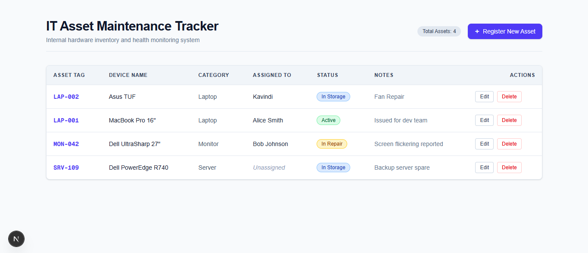
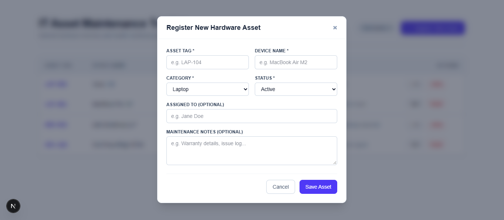
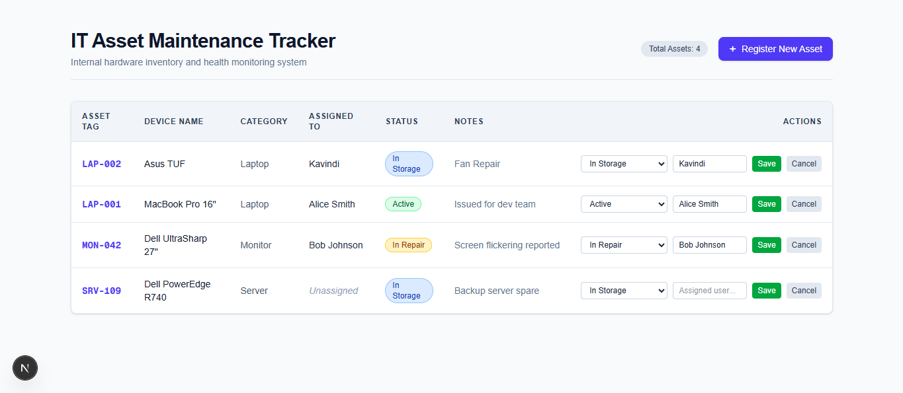

# 💻 IT Asset & Hardware Maintenance Tracker




A CRUD system built from scratch with **Next.js (App Router)**, **TypeScript**, **Tailwind CSS**, and **Native MySQL**. 

Designed to demonstrate modern React Server Components, server-side database connection pooling, type-safe Server Actions, and strict security patterns without relying on heavy ORM bloat.

---

## ⚡ Architecture Highlights & Key Technical Decisions

### 1. Zero-Bundle Data Fetching with React Server Components
Unlike traditional SPAs or legacy Next.js `pages/` that fetch data via client-side `useEffect` or API endpoints, the main inventory dashboard (`app/page.tsx`) is a **React Server Component**. 
* Queries MySQL directly on the server runtime during request execution.
* Ships **zero JavaScript** to the browser for fetching logic.
* Database credentials and query details remain strictly server-side.

### 2. MySQL Connection Pooling (`mysql2/promise`)
Instead of opening and closing database connections per request (which causes high overhead under load), database access is managed via a **centralized MySQL connection pool** (`lib/db.ts`).
* Reuses active connections in memory across HTTP requests and Server Actions.
* Configured with connection limits and asynchronous `async/await` promise wrappers.

### 3. Server Actions for Data Mutations (C/U/D)
All data mutations (creating assets, updating statuses/assignments, safe deletions) are executed via **Next.js Server Actions** (`app/actions.ts`).
* Eliminates manual REST API endpoints (`app/api/`) and client `fetch()` boilerplate.
* Leverages `revalidatePath('/')` to instantly purge server-side router caches and re-render real-time database state upon mutation.

### 4. Defense-in-Depth Security
* **SQL Injection Prevention:** All SQL statements use parameterized queries (`?` placeholders) executed via `pool.query()`.
* **Environment Isolation:** Secrets are managed via `.env.local` and kept out of client-side bundles (no `NEXT_PUBLIC_` leakage).

---

## 🛠️ Tech Stack

* **Framework:** [Next.js (App Router)](https://nextjs.org/)
* **Language:** [TypeScript](https://www.typescriptlang.org/)
* **Database:** [MySQL](https://www.mysql.com/) using [`mysql2/promise`](https://github.com/sidorares/node-mysql2)
* **Styling:** [Tailwind CSS](https://tailwindcss.com/)
* **Version Control:** Git

---

## 🗄️ Database Schema

```sql
CREATE TABLE hardware_assets (
  id           INT            NOT NULL AUTO_INCREMENT,
  asset_tag    VARCHAR(50)    NOT NULL UNIQUE,
  asset_name   VARCHAR(150)   NOT NULL,
  category     VARCHAR(80)    NOT NULL,
  assigned_to  VARCHAR(100)       NULL,
  status       ENUM(
                 'Active',
                 'In Repair',
                 'Decommissioned',
                 'In Storage'
               )              NOT NULL DEFAULT 'Active',
  notes        TEXT               NULL,
  created_at   DATETIME       NOT NULL DEFAULT CURRENT_TIMESTAMP,
  PRIMARY KEY (id)
) ENGINE=InnoDB DEFAULT CHARSET=utf8mb4 COLLATE=utf8mb4_unicode_ci;
